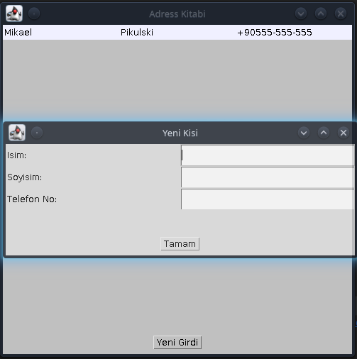

<h1 align="center">Java Telefon Rehberi</h1>

<div align="center">
  <strong>Üniversite Yil Sonu Java Sinavi icin hazirladigim Program.</strong>
</div>

<br />

<div align="center">
  
  <a href="https://github.com/Saizzou/Java_Telefon_Rehberi/graphs/contributors"></a>
  
  
</div>

<br />

# Yükleme
Yükleme islemi yada kendiniz tekrar yazabilmeniz icin gereksinimleri tamamlayiniz:

## Temel Gereksinimler:

1- Java JDK 16

2- Java awt(JDK'da bulunuyor yinede belirtmek istedim)


### Projeyi calistirma ve inceleme:

Projeyi calistirmak icin :
``` java main.java```

Hata almadiginizdan emin olduktan sonra Kullaniciniza ait Kullanici Klasörü icerisinde "AddressKitabi" adinda bir klasör olusacaktir ve ".ak" uzantisi ile Telefon Rehberiniz olusacaktir. Gelistirip Address Bilgileri de eklenecektir. (Ilerde yapabilirim, Sinavda vakit yetmedi.)

